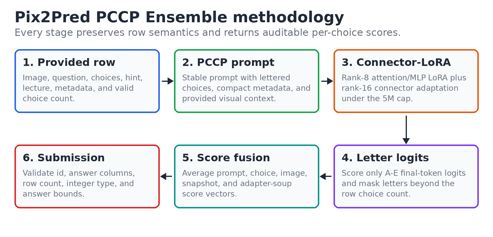
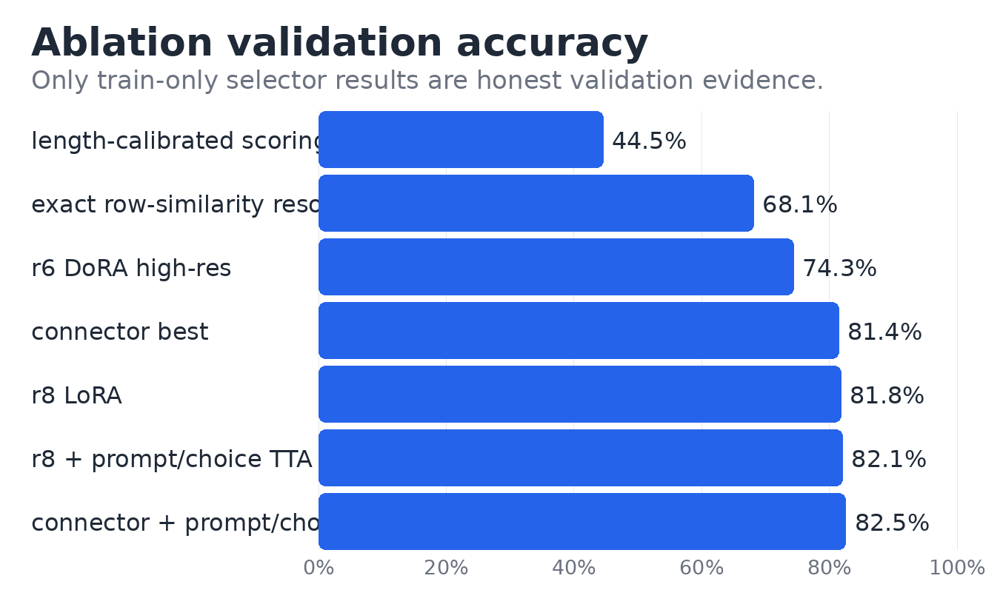

# Pix2Pred

Pix2Pred is a clean, provided-data-only training and inference pipeline for the **Pixels to Predictions** science vision-language multiple-choice challenge. It fine-tunes the official `HuggingFaceTB/SmolVLM-500M-Instruct` checkpoint under the **5,000,000 trainable-parameter cap** and produces a validated Kaggle submission file:

```csv
id,answer
test_02333,0
test_04102,2
```

The final method is the **PCCP Ensemble**:

**Provided-Context Caption Prompting + Connector-LoRA Snapshot/Adapter-Soup Ensemble**



## What The System Does

The competition is scored by classification accuracy over a zero-indexed answer choice. Pix2Pred therefore avoids long-form answer generation. For each row, it prompts the model to answer with one letter and scores only the final-token logits for valid answer letters `A` through `E`. Invalid letters are masked per row using `num_choices`.

This design keeps the model objective aligned with the submission metric:

- no free-form answer parsing;
- no malformed generated responses;
- no option-length bias from answer-text likelihood;
- one auditable per-choice score vector for every row.

The final PCCP Ensemble combines:

- direct answer-letter cross-entropy training;
- rank-8 LoRA over language attention and MLP projections;
- rank-16 LoRA on the vision-language connector projection;
- compact metadata prompting using `subject`, `grade`, and `topic`;
- provided-context caption prompting from text already present in each row;
- prompt and deterministic choice-order test-time augmentation;
- optional image-mode TTA over `nosplit512`, `nosplit768`, and `split`;
- late-checkpoint score averaging;
- same-shape adapter soup averaging;
- strict `submission.csv` validation.

## Main Results

| Method | Trainable parameters | Validation / role |
| --- | ---: | --- |
| Rank-8 Attention+MLP LoRA | `4,784,128` | `81.77%` honest validation baseline |
| Rank-8 LoRA + Prompt/Choice TTA | `4,784,128` | `82.06%` honest validation |
| Connector-LoRA r8/r16 | `4,996,096` | `81.39%` single-checkpoint validation |
| Connector-LoRA + Prompt/Choice TTA | `4,996,096` | `82.54%` best honest validation recipe |
| Rank-6 DoRA high-resolution augmentation | `3,892,224` | `74.33%`, rejected |
| Length-calibrated answer-text likelihood | same checkpoint | about `44.5%`, rejected |
| Exact row-similarity resolver | no trainable parameters | `68.13%`, rejected and removed from the maintained pipeline |
| PCCP Ensemble final submission | `4,996,096` | `90.5%` leaderboard result |



## Repository Layout

```text
configs/
  exp_lr3e-4.json                         # honest r8 attention+MLP LoRA baseline
  budgetmax_connector_r8.json             # honest Connector-LoRA selector run
  final_trainval_budgetmax_connector_r8.json
  r6_dora_attn_mlp_nosplit768_aug.json
  smoke_r8_letter.json

src/
  train.py                                # config-driven PEFT training
  inference.py                            # letter-logit inference and TTA scoring
  dataset.py                              # multimodal dataset and image handling
  data_utils.py                           # prompt formatting and answer letters
  modeling.py                             # SmolVLM loading, LoRA setup, parameter cap

scripts/
  run_smoke.sh                            # tiny sanity check
  run_ablation_suite.sh                   # honest validation sweeps
  run_final_push.sh                       # final PCCP submission pipeline
  run_inference.sh                        # single-checkpoint inference helper
  build_provided_captions.py              # builds PCCP captioned CSVs
  select_checkpoints.py                   # selects late final-family checkpoints
  soup_adapters.py                        # averages compatible PEFT adapters
  score_ensemble.py                       # averages per-choice score CSVs
  search_score_ensemble.py                # validation-gated score ensemble search
  evaluate_scores.py                      # summarizes validation score dumps

docs/
  METHODOLOGY.md                          # method rationale
  ABLATIONS.md                            # accepted and rejected experiments
  RESULTS_TEMPLATE.md                     # run logging template
```

Expected data layout:

```text
data/
  train.csv
  val.csv
  test.csv
  sample_submission.csv
  images/
    train/
    val/
    test/
```

`data/` is ignored by git because the competition package is supplied separately.

## Environment Setup

Use Python 3.10+ with a CUDA-enabled PyTorch install for training.

```bash
cd /path/to/DL
python -m venv .venv
source .venv/bin/activate
python -m pip install --upgrade pip
python -m pip install -r requirements.txt
export PY="$(which python)"
```

The first run may download the official SmolVLM checkpoint into the local Hugging Face cache. After the checkpoint and data are present, the pipeline runs from local files.

## Fresh Checkout Audit

Run this before launching long jobs:

```bash
$PY - <<'PY'
import json
from pathlib import Path

import pandas as pd

root = Path(".")
for split, needs_answer in [("train", True), ("val", True), ("test", False)]:
    csv_path = root / "data" / f"{split}.csv"
    image_dir = root / "data" / "images" / split
    assert csv_path.exists(), csv_path
    assert image_dir.exists(), image_dir

    df = pd.read_csv(csv_path)
    required = {"id", "image_path", "question", "choices", "num_choices"}
    if needs_answer:
        required.add("answer")
    missing = required.difference(df.columns)
    assert not missing, (split, missing)

    for row in df.itertuples(index=False):
        choices = json.loads(row.choices)
        assert len(choices) == int(row.num_choices), row.id
        assert (image_dir / Path(row.image_path).name).exists(), row.id
        if needs_answer:
            assert 0 <= int(row.answer) < int(row.num_choices), row.id

    print(split, "ok:", len(df), "rows")
PY
```

## One-Command Final Submission

This is the recommended final command:

```bash
OUT=submission.csv \
RUN_DIR=runs/final_push_pccp \
TOP_K=5 \
MAKE_SOUP=1 \
USE_PROVIDED_CAPTIONS=1 \
BUILD_PROVIDED_CAPTIONS=1 \
TTA_IMAGE_MODES="nosplit512 nosplit768 split" \
bash scripts/run_final_push.sh
```

The script will:

1. build reproducible PCCP captioned CSVs under `data/pccp_captioned/`;
2. train `configs/final_trainval_budgetmax_connector_r8.json` if the final adapter is missing;
3. select late checkpoints from `runs/final-trainval-budgetmax-r8-connector16`;
4. run prompt, choice-order, and optional image-mode TTA;
5. build an adapter soup when `MAKE_SOUP=1`;
6. average score CSVs;
7. write and validate `submission.csv`.

Primary outputs:

```text
submission.csv
runs/final_push_pccp/selected_checkpoints.txt
runs/final_push_pccp/final_family_checkpoint_scores.csv
runs/final_push_pccp/final_family_soup_scores.csv
runs/final_push_pccp/final_pccp_scores.csv
```

## Full Reproducibility Runbook

### 1. Static Checks

```bash
$PY -m py_compile src/*.py scripts/*.py
bash -n scripts/*.sh
```

### 2. Smoke Test

```bash
PY="$PY" bash scripts/run_smoke.sh
```

This verifies model loading, data parsing, LoRA setup, a tiny train loop, and parameter counting.

### 3. Honest Ablation Suite

```bash
bash scripts/run_ablation_suite.sh
```

This trains or reuses:

- `configs/exp_lr3e-4.json`
- `configs/budgetmax_connector_r8.json`

and evaluates:

- prompt TTA;
- deterministic choice-order TTA;
- image-mode TTA;
- PCCP captioned prompts;
- validation-gated score ensembles.

Optional DoRA/high-resolution sweep:

```bash
RUN_DORA_R6=1 bash scripts/run_ablation_suite.sh
```

Key outputs:

```text
runs/eval/*_scores.csv
runs/eval/*_report.txt
runs/eval/best_ensemble.json
data/pccp_captioned/*_captioned.csv
```

Summarize a validation score dump:

```bash
$PY scripts/evaluate_scores.py \
  --scores runs/eval/connector_best_prompt_choice_tta_scores.csv \
  --labels data/val.csv \
  --min_count 15
```

Search validation-gated score ensembles:

```bash
$PY scripts/search_score_ensemble.py \
  --labels data/val.csv \
  --score_dir runs/eval \
  --out runs/eval/best_ensemble.json \
  --pred_out runs/eval/best_ensemble_val_predictions.csv \
  --weight_steps 4 \
  --max_ensemble_size 4 \
  --candidate_pool 8
```

### 4. Final Train+Validation Fit

Run this directly when you want to train the final selected adapter before the final submission script:

```bash
$PY src/train.py --config configs/final_trainval_budgetmax_connector_r8.json
```

Expected output:

```text
runs/final-trainval-budgetmax-r8-connector16/
  best_model/
  checkpoints/
  run_metadata.json
```

The final adapter has `4,996,096` trainable parameters. `src/modeling.py` enforces the 5M cap and fails fast if a config exceeds it.

## Manual Inference

Score one adapter:

```bash
bash scripts/run_inference.sh \
  runs/final-trainval-budgetmax-r8-connector16/best_model \
  runs/final_submission_scores.csv
```

With image-mode TTA:

```bash
TTA_IMAGE_MODES="nosplit512 nosplit768 split" \
bash scripts/run_inference.sh \
  runs/final-trainval-budgetmax-r8-connector16/best_model \
  runs/final_submission_image_tta_scores.csv
```

With PCCP captions:

```bash
$PY scripts/build_provided_captions.py \
  --input_csv data/test.csv \
  --out_csv data/pccp_captioned/test_captioned.csv \
  --manifest data/pccp_captioned/test_captioned_manifest.json \
  --caption_col caption

TEST_CSV=data/pccp_captioned/test_captioned.csv \
INCLUDE_CAPTION=1 \
bash scripts/run_inference.sh \
  runs/final-trainval-budgetmax-r8-connector16/best_model \
  runs/final_submission_caption_scores.csv
```

## Submission Validation

`scripts/run_final_push.sh` validates `submission.csv` automatically. Manual validation:

```bash
$PY - <<'PY'
import pandas as pd

sub = pd.read_csv("submission.csv")
test = pd.read_csv("data/test.csv")

assert list(sub.columns) == ["id", "answer"], sub.columns.tolist()
assert len(sub) == len(test), (len(sub), len(test))
assert set(sub.id) == set(test.id)

merged = test[["id", "num_choices"]].merge(sub, on="id", how="left")
assert not merged["answer"].isna().any()
merged["answer"] = merged["answer"].astype(int)
bad = (merged["answer"] < 0) | (merged["answer"] >= merged["num_choices"])
assert not bad.any(), merged.loc[bad].head().to_dict("records")

print("submission.csv is valid:", len(sub), "rows")
PY
```

## Troubleshooting

### `No checkpoints found`

Train the final adapter:

```bash
$PY src/train.py --config configs/final_trainval_budgetmax_connector_r8.json
```

### `HARD LIMIT EXCEEDED`

The adapter has more than 5M trainable parameters. Reduce LoRA rank or target modules in the config.

### Captioned test CSV missing

Build PCCP captions:

```bash
BUILD_PROVIDED_CAPTIONS=1 USE_PROVIDED_CAPTIONS=1 bash scripts/run_final_push.sh
```

### CUDA out of memory

Use a lighter final scoring pass:

```bash
TOP_K=2 MAKE_SOUP=0 CHOICE_TTA_MAX=4 TTA_BATCH_SIZE=4 bash scripts/run_final_push.sh
```

For training, reduce `batch_size` or increase `grad_accum` in the config.

## Final Submission Checklist

- `python -m py_compile src/*.py scripts/*.py`
- `bash -n scripts/*.sh`
- `PY=$PY bash scripts/run_smoke.sh`
- `bash scripts/run_ablation_suite.sh` for reproducibility evidence
- PCCP final command above
- manual `submission.csv` validation
- update `docs/ABLATIONS.md` with any new accepted or rejected runs
- keep `submission.csv` exactly two columns: `id,answer`
